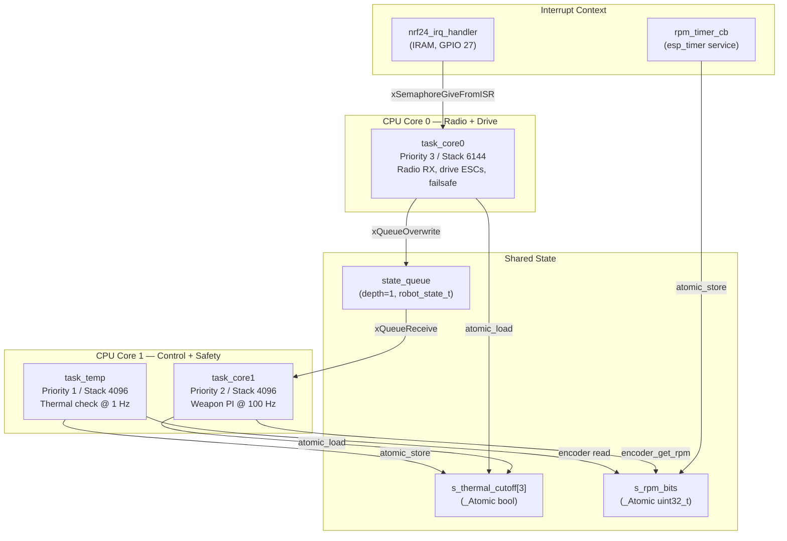
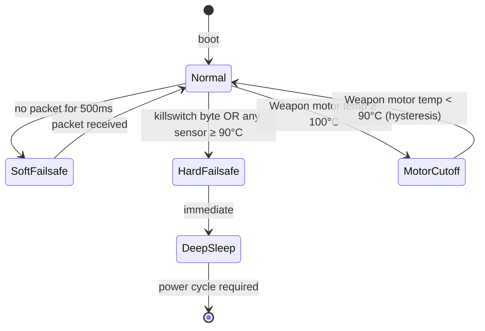

# Architecture

## System Overview

Three separate systems, each with a clearly defined responsibility:

```
┌──────────────────────────────────────────────────────────────────┐
│ DRIVER STATION (Laptop)                                          │
│  Python + Pygame + PySerial                                      │
│  Reads gamepad/keyboard → builds 4-byte control packet          │
│  Sends at 50 Hz over USB CDC serial                              │
└────────────────────────┬─────────────────────────────────────────┘
                         │ USB CDC @ 115200 baud
                         ▼
┌──────────────────────────────────────────────────────────────────┐
│ RADIO DONGLE (nRF52840 PCA10059)                                 │
│  Zephyr RTOS + Nordic ESB library                                │
│  Parses serial bytes → packs into 4-byte ESB payload            │
│  Transmits over 2.4 GHz Enhanced ShockBurst                     │
└────────────────────────┬─────────────────────────────────────────┘
                         │ 2.4 GHz ESB, 2 Mbps, channel 40
                         ▼
┌──────────────────────────────────────────────────────────────────┐
│ ROBOT CONTROLLER (ESP32 DevKit)                                  │
│  ESP-IDF + FreeRTOS + custom nRF24L01+ driver                   │
│  Receives ESB packets → drives motors, weapon, safety           │
│  Core 0: radio RX, drive motors, failsafe                       │
│  Core 1: weapon speed controller (PI), thermal safety           │
└──────────────────────────────────────────────────────────────────┘
```

**Driver station** is stateless with respect to the robot — it does not know if packets were received. The robot enforces its own safety timeout independently.

**Dongle** is a bridge forwarding the serial packets to the radio periphal. It does not interpret packet content or cache anything. If serial goes silent, the dongle stops transmitting, triggering the robot's timeout.

**Robot** owns all safety logic. If anything goes wrong — lost radio, high temperature, killswitch — the robot reacts on its own by shutting down the system.

---

## FreeRTOS Task Architecture

Three tasks across two CPU cores:



### task_core0 — Radio Receive and Drive Control

**Core:** 0 | **Priority:** 3 | **Stack:** 6144 bytes

Blocks on `nrf24_irq_sem` with a 50 ms timeout — scheduled by hardware interrupts, not a timer. When a packet arrives, the IRQ fires, the semaphore is given from ISR, and this task unblocks within one FreeRTOS tick (~1 ms). Owns the nRF24L01+ SPI driver, drive motor PWM outputs, packet timeout failsafe, and deep-sleep entry.

### task_core1 — Weapon PI Speed Controller

**Core:** 1 | **Priority:** 2 | **Stack:** 4096 bytes

Runs at exactly **100 Hz** using `vTaskDelayUntil`. Each iteration: reads the latest state from `state_queue` (non-blocking), determines weapon mode, calls `weapon_controller_update()`.

### task_temp — Thermal Safety Monitor

**Core:** 1 | **Priority:** 1 | **Stack:** 4096 bytes

Runs at **1 Hz** with a 500 ms startup delay (gives BMP280 time to complete its first measurement). Calls `motor_safety_check()` which reads all three temperature sensors and latches/clears thermal cutoff flags.

### Concurrency Model

Three primitives are used; nothing else is needed:

**`state_queue` (FreeRTOS queue, depth=1)** — passes `robot_state_t` from task_core0 to task_core1. `xQueueOverwrite` is used (not `xQueueSend`) so it always contains the latest value. `xQueueReceive` with zero timeout on the reader side keeps the 100 Hz weapon loop from ever blocking on Core 0.

**`_Atomic bool` (s_thermal_cutoff[3])** — passes thermal cutoff flags from task_temp to both other tasks. Single-writer, multiple-reader; the C11 atomic is a single hardware instruction on Xtensa.

**`_Atomic uint32_t` + memcpy (s_rpm_bits)** — passes the RPM float from the esp_timer callback to task_core1. C11 does not provide `_Atomic float`; the IEEE-754 bit pattern is stored as a uint32_t and reinterpreted with memcpy on both sides. `memory_order_release`/`acquire` ensures the store is visible to the reader.

---

## Safety Architecture




### Packet Timeout (Soft Failsafe)

`LINK_LOSS_TIMEOUT_MS` (currently 500 ms) without a valid packet → stop all motors, zero weapon throttle, set `failsafe_active`. Fully automatic recovery on next valid packet.

This value is inherited rather than measured. `task_radio` now logs the observed
inter-packet gap distribution every 5 s (`LINK: … <=50:… <=100:… >500:…`), so
the timeout can be set from the real worst-case gap plus margin. Tightening it
below the link's actual p100 gap makes the robot cut out mid-match on ordinary
2.4 GHz interference.

### Task Watchdog (300 ms)

`task_radio` and `task_weapon` subscribe to the ESP-IDF task watchdog. Either
one failing to check in for `TASK_WDT_TIMEOUT_MS` panics the chip. The ESCs see
no PWM while it reboots and disarm, so a hung control task cannot leave the
weapon powered. `task_thermal` runs at 1 Hz and is deliberately not subscribed,
and the idle tasks are excluded because they legitimately starve under load.

### Weapon Feedback Fault

The weapon PI loop closes on Hall-sensor RPM. If the sensor stops reporting
while the weapon is being driven, that RPM is not a measurement, and closing a
loop on it is worse than not closing one: measured RPM reads 0, the error
becomes the entire target, and the integrator drives the output to full
throttle on a spinning weapon.

`safety_monitor` watches for the weapon being commanded above 20% for
`WEAPON_FEEDBACK_FAULT_MS` with no Hall edge at all, and when the INA3221 is
fitted uses weapon current to suppress false positives when the ESC is not
actually delivering power. On fault the controller holds its integrator at zero
and emits the bare feed-forward term, which is exactly the open-loop behaviour
this firmware shipped before the loop existed.

### Battery Sag (optional)

The weapon is the largest load on the pack, so dropping it first preserves
drive and radio. Disabled by default: set `WEAPON_BATTERY_CELLS` in
`robot_config.h` and validate the threshold on the bench under real weapon
load. A cut level taken from a datasheet rather than a measurement will drop
the weapon mid-match, since spin-up sags the pack hard and briefly.

### Killswitch (Hard Failsafe)

Packet byte 3 > 127 → stop motors, `esp_deep_sleep_start()`. Power cycle only to recover. The ground station sends a burst of 5 consecutive killswitch packets to ensure delivery even if 1–2 are dropped.

### Thermal Deep Sleep (90 °C)

Temperature sensor ≥ 90 °C → same as killswitch. This check runs in `task_core0` on **every received packet** (50 Hz), not in the 1 Hz thermal task, so worst-case detection latency is 20 ms.

### Thermal Cutoff (100 °C)

Weapon motor ≥ 100 °C → zero throttle for that motor only, with 10 °C hysteresis on recovery. Implemented in `motor_safety_check()` via `task_temp`. This is the only reversible thermal protection.

### Arm/Disarm and Weapon State Machine

Implemented entirely in the Python ground station. When `armed = False`, the station sends neutral packets. The robot has no "armed" concept — it acts on whatever values it receives.

The weapon state machine prevents jumping from safe to attack:
```
safe → idle (RB press)
idle → attack (RT held)
attack → idle (RT released)
idle → safe (RB press)
any → safe (disarm or failsafe)
```

### Failure Mode Summary

| Failure | Detected by | Response | Recoverable? |
|---|---|---|---|
| Radio link drop | Packet timeout (500 ms) | Stop motors | Yes — auto on reconnect |
| Operator killswitch | Packet byte 3 > 127 | Deep sleep | No — power cycle |
| Any sensor ≥ 90 °C | Packet receive check | Deep sleep | No — power cycle |
| Any motor ≥ 100 °C | task_temp (1 Hz) | Cut that motor | Yes — hysteresis |
| I²C sensor failure | isnan(temp) check | Cut associated motor | Yes — if sensor recovers |
| Serial link drop | Robot packet timeout | Stop motors | Yes — auto |
| ESP32 watchdog reset | Firmware crash | All GPIO reset | Depends on crash cause |
| Real-time task stalls | Task watchdog (300 ms) | Panic + reset; ESCs disarm on loss of PWM | Yes — on reboot |
| Weapon Hall sensor failure | `safety_monitor`: commanded > 20% for 1500 ms with no edge | Integrator held at zero, weapon runs open-loop at 50% FF | Yes — auto when edges return |
| Pack voltage sag | `safety_monitor` (20 Hz, INA3221) | Weapon inhibited, drive and radio preserved | Yes — on recovery + hysteresis |
| Brownout reset | `esp_reset_reason()` at boot | Logged; robot comes up disarmed | Yes — on reboot |

---

## Hardware Topology

```
┌─────────────────────────────────────────────────────────────┐
│ LAPTOP                                                      │
│  USB-A port                                                 │
└──────────────────┬──────────────────────────────────────────┘
                   │ USB 2.0 Full Speed
                   ▼
┌─────────────────────────────────────────────────────────────┐
│ nRF52840 USB DONGLE (PCA10059)                              │
│  2.4 GHz radio (ESB PTX, channel 40)                        │
│  USB Device (CDC ACM, 2 interfaces)                         │
│  Status LED (green, GPIO 0.06)                              │
└─────────────────────────────────────────────────────────────┘
                   │ 2.4 GHz RF, Enhanced ShockBurst
                   ▼
┌─────────────────────────────────────────────────────────────┐
│ ESP32 DEVKIT                                                │
│                                                             │
│  nRF24L01+ MODULE (SPI slave)                               │
│    MISO=19, MOSI=23, CLK=18, CSN=5, CE=4, IRQ=27           │
│                                                             │
│  LEFT ESC (GPIO 14) │ RIGHT ESC (GPIO 13) │ WEAPON (GPIO 21)│
│  All 50Hz PWM via MCPWM group 0                             │
│                                                             │
│  I²C BUS 0 (SDA=22, SCL=33, 400 kHz)                       │
│    BMP280 @ 0x76 — left wheel temp                         │
│    BMP280 @ 0x77 — right wheel temp                        │
│                                                             │
│  I²C BUS 1 (SDA=25, SCL=26, 400 kHz)                       │
│    BMP280 @ 0x76 — weapon motor temp                       │
│                                                             │
│  PCNT GPIO 15 — Hall encoder, 2 pulses/rev, 20 ms timer     │
└─────────────────────────────────────────────────────────────┘
```

### ESP32 GPIO Assignments

| GPIO | Function | Connected to |
|---|---|---|
| 4 | nRF24 CE | nRF24L01+ CE |
| 5 | nRF24 CSN | nRF24L01+ CSN (manual, active low) |
| 13 | PWM RIGHT | Right wheel ESC signal |
| 14 | PWM LEFT | Left wheel ESC signal |
| 15 | ENCODER | Optical encoder output (PCNT, pull-up) |
| 18 | SPI CLK | nRF24L01+ SCK (SPI3_HOST) |
| 19 | SPI MISO | nRF24L01+ MISO |
| 21 | PWM WEAPON | Weapon ESC signal |
| 22 | I²C0 SDA | BMP280 @ 0x76, 0x77 |
| 23 | SPI MOSI | nRF24L01+ MOSI |
| 25 | I²C1 SDA | BMP280 @ 0x76 |
| 26 | I²C1 SCL | BMP280 @ 0x76 |
| 27 | nRF24 IRQ | Active low, GPIO_INTR_NEGEDGE, pull-up |
| 33 | I²C0 SCL | BMP280 @ 0x76, 0x77 |

### SPI Bus (nRF24L01+)

SPI3_HOST (VSPI), 8 MHz, mode 0, manual CS (GPIO 5), polling transmit (no DMA). Polling is faster than DMA for the ≤33-byte transactions used here.

### MCPWM

Group 0, 1 MHz resolution (1 µs/tick), 20,000-tick period (50 Hz). PWM_MIN=1000, PWM_NEUTRAL=1500, PWM_MAX=2000 (all in µs). All three ESCs share one timer — signals are synchronised.

### Hall Sensor (Weapon RPM)

GPIO 15, both-edge GPIO interrupt, 200 µs software glitch reject, exponentially
smoothed edge interval. RPM = `60e6 / (period_µs × 2)`.

This replaced a PCNT counter that summed edges over a fixed 20 ms window, where
RPM = `count × 1500`. That grid quantised the signal to 1500 RPM per count, so
the 5000 RPM attack target was not representable at all and the closed-loop
gains could not be tuned against it. Timing the interval instead gives about
0.83 RPM per microsecond at 5000 RPM, roughly 1800× finer. See
[Weapon Tuning](firmware/weapon-tuning.md).

---

## See Also

- [Robot Firmware](firmware/robot-firmware.md)
- [Weapon Tuning](firmware/weapon-tuning.md) — closing the speed loop
- [Hardware Pinout](hardware/pinout.md)
- [Hardware Wiring](hardware/wiring.md)
